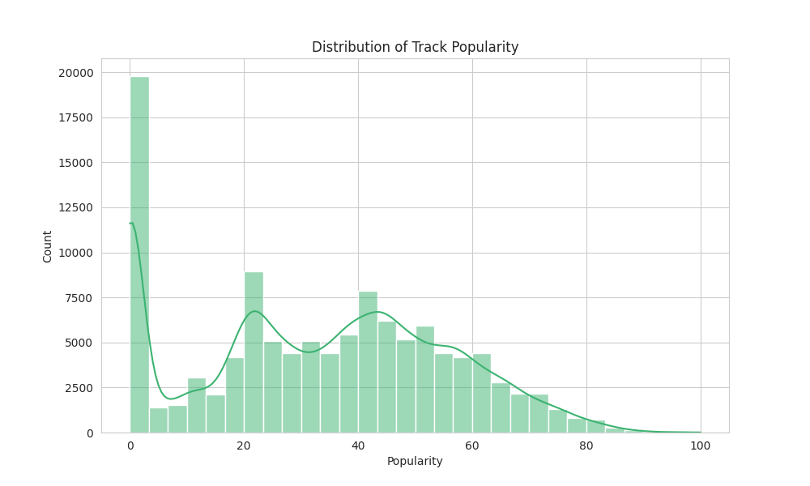
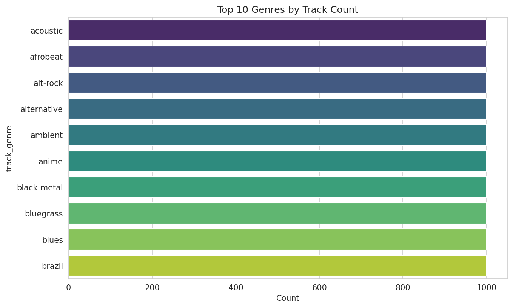
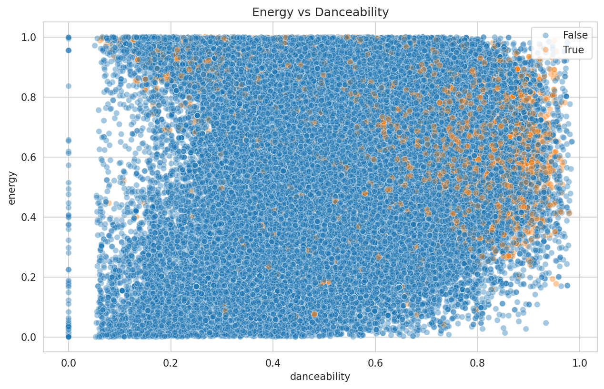
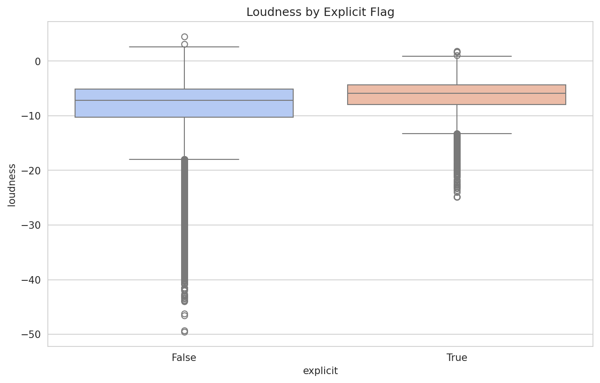
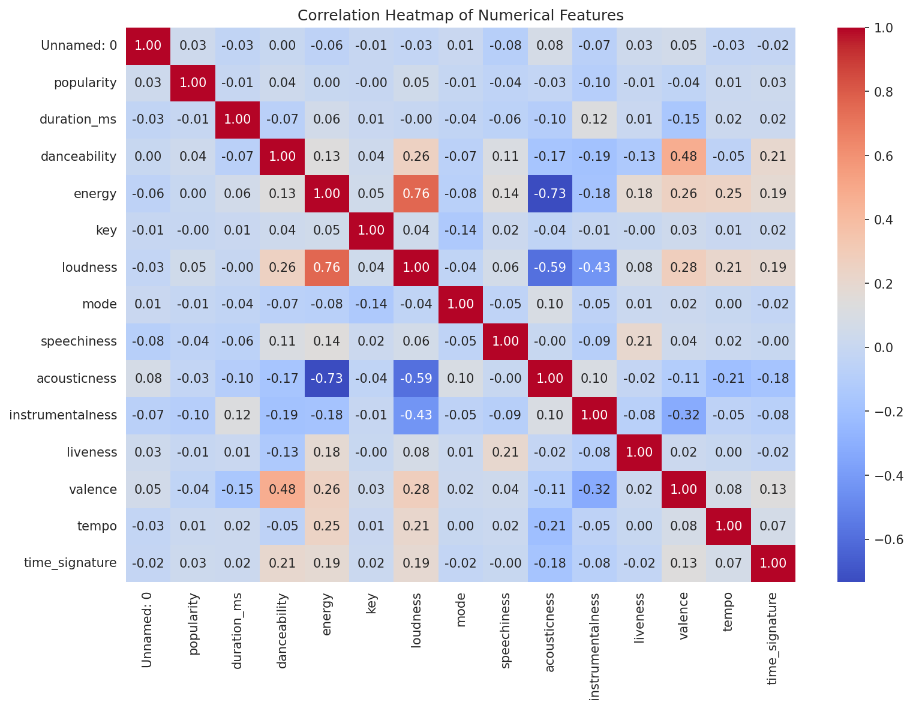
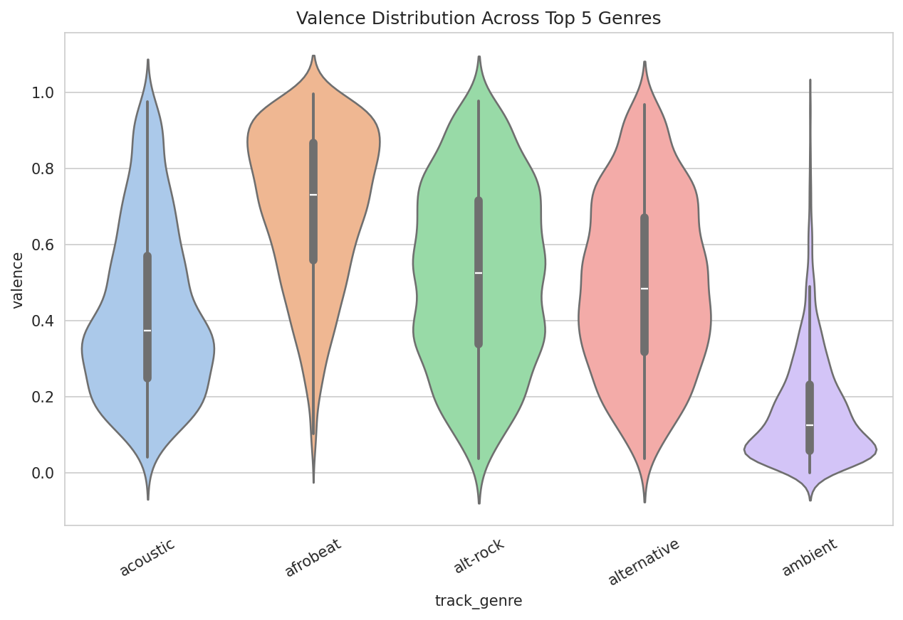

# Epochs '26 — Assignment 4: Spotify Tracks EDA & Visualization

## 📁 Dataset Overview

- **Source:** [Spotify Tracks Dataset](https://www.kaggle.com/datasets/maharshipandya/-spotify-tracks-dataset) (Kaggle)
- **File used:** `dataset.csv`
- **Shape:** 114,000 rows × 21 columns
- **Key columns:** `track_id`, `artists`, `album_name`, `track_name`, `popularity`, `duration_ms`, `explicit`, `danceability`, `energy`, `key`, `loudness`, `mode`, `speechiness`, `acousticness`, `instrumentalness`, `liveness`, `valence`, `tempo`, `time_signature`, `track_genre`
- **Numerical features:** popularity, duration_ms, danceability, energy, key, loudness, mode, speechiness, acousticness, instrumentalness, liveness, valence, tempo, time_signature
- **Categorical features:** track_id, artists, album_name, track_name, track_genre
- **Missing values:** 1 missing value each in `artists`, `album_name`, `track_name` — dropped before analysis
- **Duplicate rows:** 0
- **Genre balance:** ~1,000 tracks per genre (114 genres total) — dataset is evenly balanced by genre

---

## 📊 Visualizations & Insights

### 1. Distribution of Track Popularity (Histogram)

**Insight:** Popularity is heavily right-skewed, with a large spike near 0 (~20,000 tracks with almost no plays) — likely unreleased or obscure tracks. The rest of the distribution is fairly spread out with mild peaks around 20, 40, and 50, and a long tail toward 100, meaning very few tracks achieve true "hit" status.

### 2. Top 10 Genres by Track Count (Bar Chart)

**Insight:** All genres shown have nearly identical counts (~1,000 each). This confirms the dataset is artificially balanced by genre, so genre-based comparisons reflect actual track characteristics rather than sampling bias.

### 3. Energy vs Danceability (Scatter Plot)

**Insight:** No strong linear relationship exists between danceability and energy — points are spread across the full range. Explicit tracks (orange) cluster more toward higher danceability and energy, suggesting explicit content trends toward livelier, more upbeat tracks.

### 4. Loudness by Explicit Flag (Box Plot)

**Insight:** Explicit tracks have a noticeably higher median loudness and a tighter distribution. Non-explicit tracks show a wider spread with many low-loudness outliers (down to -40 dB), likely from quiet acoustic/ambient tracks.

### 5. Correlation Heatmap of Numerical Features

**Insight:** Energy and loudness are strongly positively correlated (r = 0.76) — louder tracks tend to be more energetic. Energy and acousticness are strongly negatively correlated (r = -0.73), and loudness vs. acousticness is also strongly negative (r = -0.59). Danceability and valence show a moderate positive relationship (r = 0.48), meaning danceable tracks tend to sound happier.

### 6. Valence Distribution Across Top 5 Genres (Violin Plot)

**Insight:** Afrobeat skews distinctly happier (high median valence, ~0.75+), while ambient skews distinctly sadder/moodier (low median valence, ~0.3). Acoustic, alt-rock, and alternative show wide, evenly spread valence — meaning mood varies significantly within those genres rather than leaning one way.

---

## 🧾 Overall Conclusions

1. **Popularity is heavily skewed** — most tracks have low-to-moderate popularity, and only a small fraction achieve high popularity scores.
2. **The dataset is genre-balanced** (~1,000 tracks per genre across 114 genres), making cross-genre comparisons fair and unbiased.
3. **Energy and loudness are the most tightly linked audio features** (r = 0.76), while energy and acousticness move in opposite directions (r = -0.73) — acoustic tracks are inherently quieter and less energetic.
4. **Explicit tracks tend to be louder and more energetic/danceable** than non-explicit tracks.
5. **Mood (valence) varies strongly by genre** — afrobeat is the happiest-sounding genre among the top 5, ambient is the calmest/saddest, while acoustic, alt-rock, and alternative span the full emotional range.
6. **Audio "feel" (energy, loudness, acousticness, valence) is more genre-dependent than popularity is** — popularity appears driven more by external factors like artist fame and marketing rather than the song's audio characteristics alone.

---

## 📂 Repository Contents
- `visualization.ipynb` — Complete EDA, visualizations, and analysis
- `README.md` — This file
